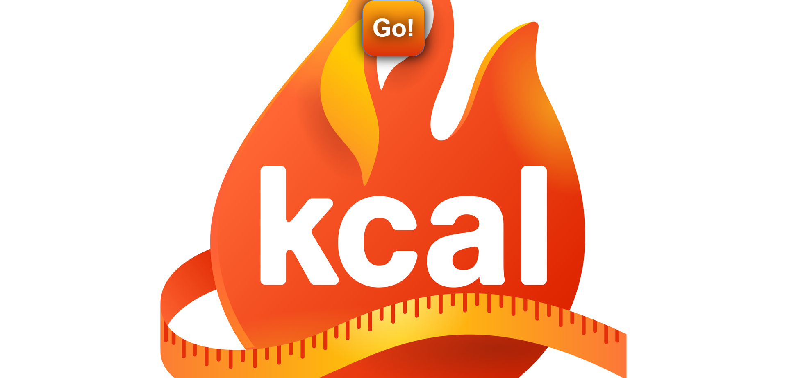
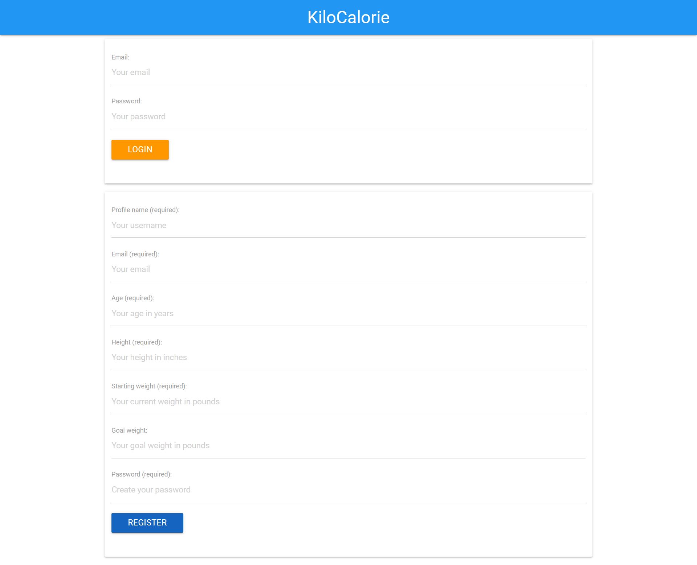
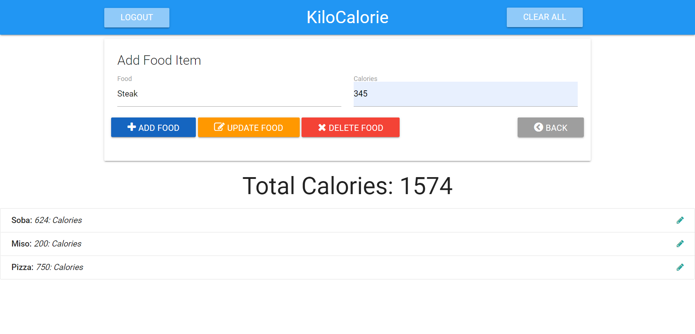

# Fitness Application

[Fitness-App Deploy on Heroku](https://kilocalorie.herokuapp.com/)

## Description

An express.js application using mySQL and Sequelize database structures. Users can create and store profiles containing their personal health goal indices alongside a log of their daily meals with calorie intake calculations.  
User data is secured with their passwords at login.

## Table of Contents

- [Technology](#technology)
- [Installation Instructions](#installation)
- [Usage Information](#usage)
- [License](#license)
- [Contribution Guidelines](#contributing)
- [Test Instructions](#testing)
- [Questions?](#questions?)

## Technology

- [node.js](https://nodejs.dev/)
- [mySQL](https://dev.mysql.com/doc/mysql-installation-excerpt/5.7/en/)
- [npm Express.js](https://expressjs.com/)
- [npm express-session](https://www.npmjs.com/package/express-session)
- [npm connect-session-sequelize](https://www.npmjs.com/package/connect-session-sequelize)
- [npm handlebars](https://www.npmjs.com/package/handlebars)
- [npm express-handlebars](https://www.npmjs.com/package/express-handlebars)
- [npm dotenv](https://www.npmjs.com/package/dotenv)
- [npm bcrypt](https://www.npmjs.com/package/bcrypt)

## Installation

To use Fitness-App, visit the deployed application at [Fitness-App Deploy on Heroku](https://kilocalorie.herokuapp.com/).
The repository can also be cloned onto your local machine, and requires the install of [node.js](https://nodejs.dev/), [mySQL](https://dev.mysql.com/doc/mysql-installation-excerpt/5.7/en/) and npm packages. Follow instructions on [node.js website](https://nodejs.dev/) and [mySQL site](https://dev.mysql.com/doc/mysql-installation-excerpt/5.7/en/), then by running the following from your CLI in the cloned repository's folder:

```
> npm i
```

After establishing your mySQL user settings, setup the database via the following:

```
> USE calorie_tracker_db;
> source db/schema.sql;
> exit;
```

Run your local Fitness-App by executing `npm start` from the command line.

## Usage

<br>
The landing page for Fitness-App. Click the Go! button to begin!<br><br>

<br>
On the login and register page, users must first register with their personal health information and goals. All future visits will require a login.<br><br>

<br>
Once in the calorie tracking section, a user can add, update, and delete daily food items. All added food items are added to the daily calorie total and displayed at the bottom of the screen. The logout button allows the next user to create their personal profile and begin adding their own protected health information and daily caloric intake.<br>

## License

This project was created using MIT license.

## Contributing

This is an open source project.

Future deployments to calculate BMI, track health data, and apply data gathered from wearables is forthcoming.

## Testing

To test the program, please follow above Installation guide.

## Questions?

This program was created by:<br>
[Brandon Pena on Github](https://github.com/Brandonpena97)<br>
[Sunita Maharaj Persad on Github](https://github.com/Sunita002)<br>
[ru3ykat on Github](https://github.com/RU3YKat)<br>
[Vanessa Sylverain on Github](https://github.com/sylverainv)
